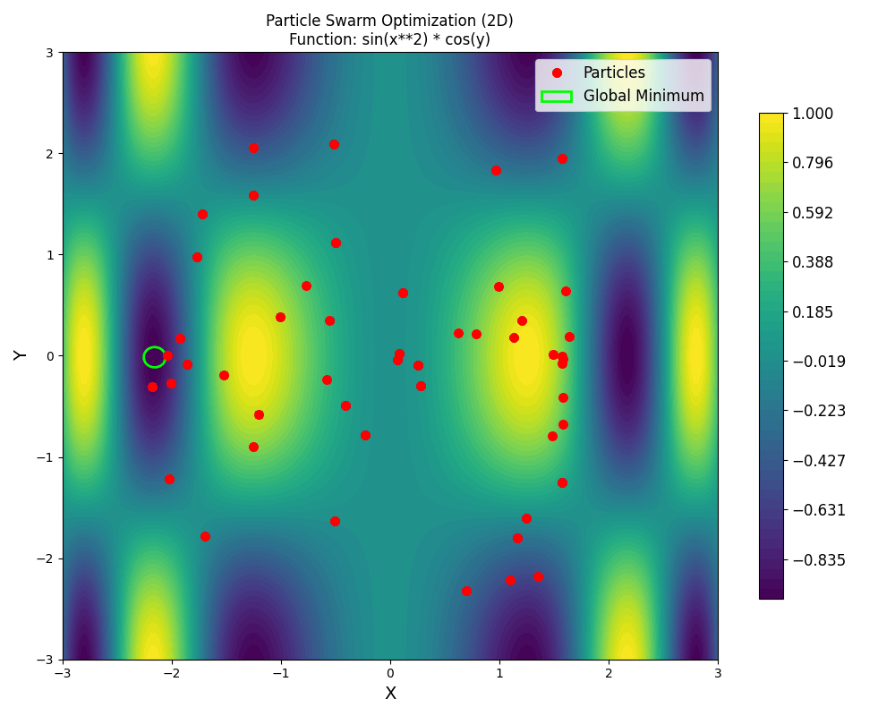

```markdown
# Particle Swarm Optimization (PSO) Visualization

This project interactively visualizes the PSO algorithm optimizing functions of two variables. Observe particles swarm towards the global minimum on different functions in 2D or 3D.

## Examples

- **Default Example Objective Function in 3D:**

  ```bash
  python main.py --3d --save
  ```

  

- **Custom Objective Function in 2D:**

  ```bash
  python main.py --function "sin(x**2) * cos(y)" --save
  ```

  

- **Random Objective Function in 3D:**

  ```bash
  python main.py --random --3d --save
  ```

  

## Introduction

Particle Swarm Optimization (PSO) is a population-based stochastic optimization technique inspired by the social behavior of bird flocking or fish schooling. It is a versatile algorithm capable of finding both the minimum and the maximum (the optima) of a function. Instead of directly searching for a maximum, PSO typically finds the minimum of a function. To find the maximum of a function using PSO, you would optimize the negative of that function, as finding the minimum of −f(x) will find the maximum of f(x).

## Features

- **Interactive Visualization**: Real-time particle swarming.
- **Custom Functions**: Optimize the default, your own, or random functions.
- **2D and 3D Modes**: Visualize with contour or surface plots.
- **Save Animations**: Save the generated visualizations as GIF files.

## Getting Started

### Prerequisites

Ensure you have Python 3 and these packages:

```bash
pip install numpy matplotlib sympy Pillow
```

### Running the Project

Clone and navigate to the project directory:

```bash
git clone https://github.com/anngo-1/pso.git
cd pso
```

Run the script:

```bash
python main.py
```

This runs the default visualization in 2D.

## Usage

Customize the script with command-line arguments:

- `--3d`: Enable 3D visualization.
- `--function FUNCTION`: Specify a Python expression for the function (e.g., `'sin(x) + cos(y)'`).
- `--random`: Use a randomly generated function.
- `--save`: Save the animation as a GIF file in the specified directory.
- `--save_path PATH`: Specify the directory to save the animation (default: `examples`).

## How It Works

### The PSO Algorithm

Particles update their position based on their personal best and the swarm's best, balancing exploration and exploitation.

**Velocity Update:**

`v_i(t+1) = w * v_i(t) + c_1 * r_1 * (p_i - x_i(t)) + c_2 * r_2 * (g - x_i(t))`

**Position Update:**

`x_i(t+1) = x_i(t) + v_i(t+1)`

## Code

### `main.py`

Entry point handling argument parsing, objective function setup, PSO initialization, visualization, and saving functionality.

### `pso.py`

Contains the `PSO` class implementing the algorithm, including initialization and the update method.

### `objective_functions.py`

Defines the default, random, and Gaussian helper functions.

## Customize and Experiment

Tweak parameters in `pso.py` or define new functions in `objective_functions.py`.

- **Change Number of Particles**: Adjust `n_particles`.
- **Adjust Coefficients**: Modify `c1` and `c2`.
- **Modify Inertia**: Experiment with `w`.
- **Define Functions**: Add your own in `objective_functions.py` or use the `--function` command-line argument.
- **Experiment with Bounds**: Change the search space limits within the `PSO` class initialization.
```